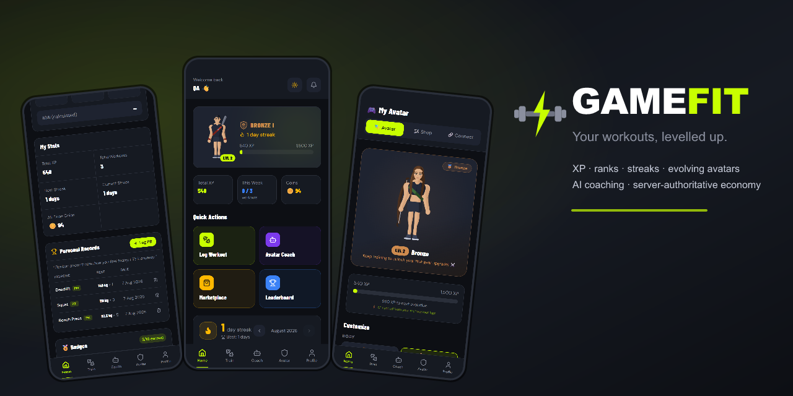
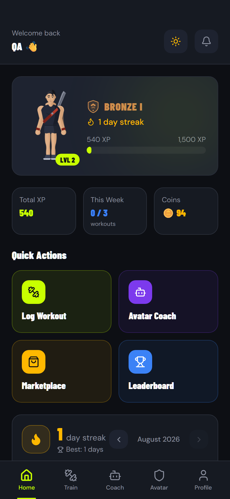
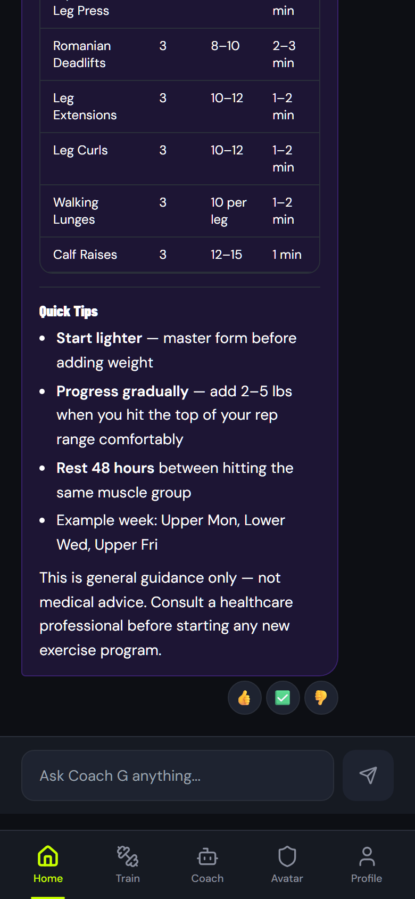
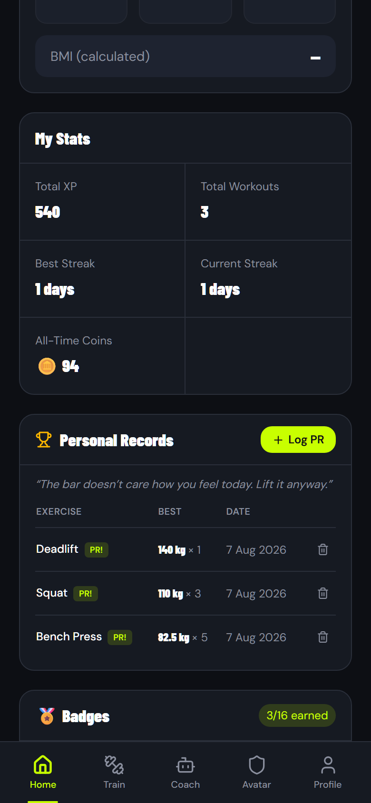
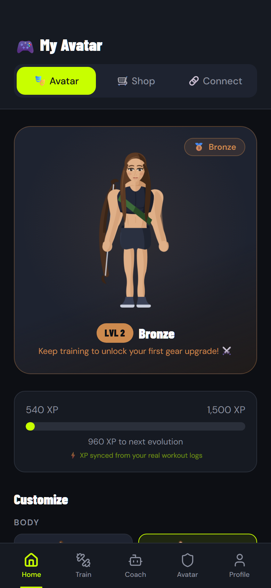
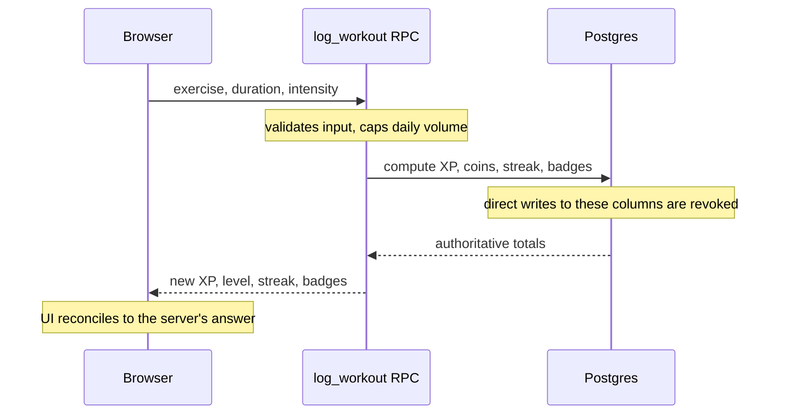
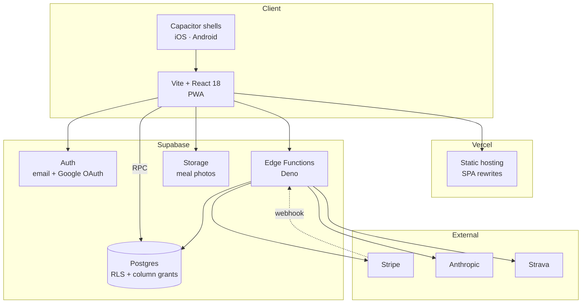

<p align="center">
  
</p>

<p align="center">
  
  
  
  
  
  
</p>

<p align="center">
  <a href="https://gamefit-app.vercel.app"><b>Live app</b></a> ·
  <a href="docs/STORE_SUBMISSION.md">Store submission guide</a> ·
  <a href="LAUNCH_CHECKLIST.md">Launch checklist</a>
</p>

---

GameFit turns training into an RPG. You log a workout, the server works out what
it was worth, and you get XP, coins and a streak back. Enough of those and you
climb the rank ladder, your avatar picks up better gear, and Coach G starts
giving advice shaped by your actual training history rather than generic tips.

The interesting engineering problem here isn't the game layer. It's that a
fitness game is trivially cheatable if the browser is allowed to decide how much
XP you earned. Everything below follows from refusing to let it.

## Screens

| Dashboard | Coach G | Personal records | Avatar |
|:---:|:---:|:---:|:---:|
|  |  |  |  |
| Rank, streak and weekly goal at a glance | Answers render as real tables and charts | Best lift per exercise, with PR badges | Two rigs, five classes, five tiers |

## What it does

**Progression.** Five rank tiers with Roman-numeral sub-ranks, Bronze through
Apex. Daily streaks on an Asia/Dubai day boundary, a monthly streak calendar,
badges, and a 14-day XP chart.

**Avatars.** Layered SVG, drawn at runtime rather than shipped as sprites: two
body rigs × 5 classes × 5 gear tiers, plus skin tones, hairstyles and shop
accessories. Both rigs share gear anchor points, so all 25 class/tier gear sets
fit either body without redrawing a single pauldron.

**Coach G.** Claude Haiku, called only from an Edge Function so the API key
never reaches a browser. Prompts carry your profile, get sanitised against
injection, drop into a conservative mode for under-18 users, and are capped at
10 requests a month on the free tier — counted in Postgres, not in localStorage.

**Personal records.** Self-reported best weight × reps per lift, with dates and
PR badges. These award badges but deliberately no XP or coins: an unverifiable
number should never move the leaderboard.

**Payments.** Stripe subscriptions in AED, with prices discovered from the
Stripe API at runtime instead of hardcoded IDs. The webhook is signature-verified
and self-heals on `invoice.paid`.

## Keeping the economy honest

The original build computed XP in React and wrote the result to the database.
Anyone with devtools could award themselves a level. The rewrite moved every
reward decision into `SECURITY DEFINER` Postgres functions and then revoked the
client's ability to write those columns at all.



Concretely: `revoke update on profiles from authenticated`, then `grant update`
on the fourteen columns a user may legitimately edit. XP, coins, streaks,
badges, premium status and role aren't among them. Strava tokens live in a table
with no policies and no grants, so PostgREST can't reach them with any user key.

The suite in `scratchpad/e2e_test.py` checks both halves of that: the exact
arithmetic on the happy path, and a 401/403/42501 on every attempt to write a
protected column directly.

## Architecture



Edge Functions: `coach-g`, `create-checkout`, `stripe-webhook`, `strava-auth`,
`delete-account`. Server secrets live in the Supabase dashboard and are never
committed — see `.env.example` for the boundary between browser-safe and
server-only values.

## Tech

| Layer | Choice |
|---|---|
| Frontend | Vite, React 18, Tailwind, Radix/shadcn, framer-motion, recharts |
| Backend | Supabase Postgres with RLS and column-level grants |
| Server logic | Postgres RPCs (`SECURITY DEFINER`) + Deno Edge Functions |
| Auth | Supabase Auth, email and Google OAuth (system browser on native) |
| Payments | Stripe subscriptions, signature-verified webhook |
| AI | Claude Haiku, server-side only |
| Native | Capacitor 7 |
| Analytics | PostHog and Sentry, both inert until keys are set |
| Hosting | Vercel, auto-deploy from `main` |

## Running it locally

You'll need Node 18+ and a Supabase project.

```bash
git clone https://github.com/muhammet-tm/gamefit-app.git
cd gamefit-app
npm install
cp .env.example .env.local
npm run dev
```

Fill `.env.local` with your project's URL and anon key from **Project Settings →
API**. Both are browser-safe by design. Then apply the schema:

```bash
npx supabase link --project-ref YOUR-PROJECT-REF
npx supabase db push
npx supabase functions deploy
```

Edge Function secrets (`ANTHROPIC_API_KEY`, `STRIPE_SECRET_KEY`,
`STRIPE_WEBHOOK_SECRET`, Strava and Resend credentials) go in the Supabase
dashboard under **Edge Functions → Secrets**. Never in this repo.

## Scripts

| Command | What it does |
|---|---|
| `npm run dev` | Dev server on :5173 |
| `npm run build` | Production build |
| `npm run lint` | ESLint |
| `npm run typecheck` | Type check |
| `node scripts/render-avatars.mjs [dir]` | Rasterise every avatar combination to PNG contact sheets for art review |
| `node scripts/generate-brand-assets.mjs` | Regenerate icons, favicons, splash screens and the OG image from the brand mark |
| `node scripts/store-screenshots.mjs` | Capture App Store and Play Store screenshots at required resolutions |
| `node scripts/readme-assets.mjs` | Recapture the screenshots and hero image on this page |

## Layout

```
src/
  components/avatar/     layered SVG avatar system (rigs, hair, class gear, tiers)
  components/gamefit/    app-specific UI (rank emblem, streak calendar, records…)
  components/ui/         Radix/shadcn primitives
  lib/                   GameFitContext, ranks, badges, validation, analytics
  pages/                 one file per route
supabase/
  migrations/            schema, RLS, column grants, economy RPCs
  functions/             Deno Edge Functions
scripts/                 build-time and art-review tooling
docs/                    store submission guide, setup notes, images
android/  ios/           Capacitor native shells
```

## Status

The web app is live on Vercel and functional end to end: accounts, onboarding,
workout logging, the full economy, AI coaching, Stripe checkout, and account
deletion. Native shells build from the same codebase and follow the reader-app
pattern — subscriptions are sold on the web only, which keeps the apps within
Apple's and Google's rules on digital goods.

Not done yet, and worth being straight about:

- Neither app has been submitted to a store. `docs/STORE_SUBMISSION.md` has the
  full checklist.
- `/privacy` and `/terms` are drafts and marked as such in the app. They have
  not been reviewed by a lawyer.
- QA has been automated (Playwright plus direct API tests) but the app has not
  had a full pass on physical devices.
- The marketplace screen is a placeholder and the friends leaderboard is not
  built.

`CLAUDE.md` carries the current engineering context and the reasoning behind the
decisions above.
